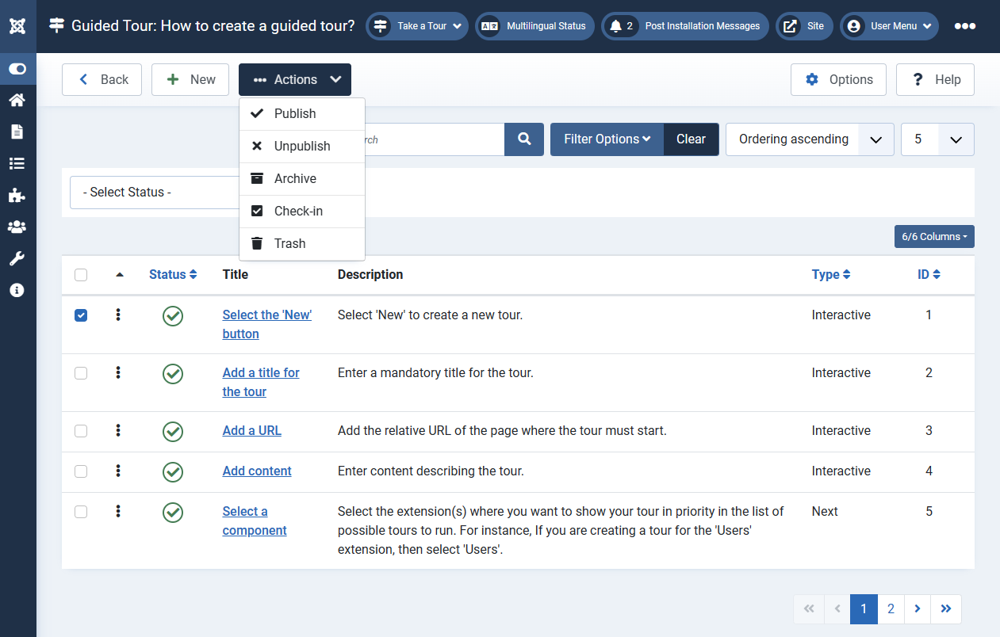

# Guided Tours Steps

## Description

The guided tours give users the ability to complete walk-throughs (or tours) to better understand the interface they are learning to use. Steps are necessary in the building of a tour.

## How to Access

**System** -> **Manage** -> **Guided Tours**

Enter a tour's steps screen by selecting the steps number from the Steps column.

## Screenshot

## Column Headers

- **Checkbox**. Check this box to select steps. To select all steps, check the box in the column heading. After boxes are checked the toolbar button 'Actions' get active.

- **Ordering**. You can change the order of a step within a list as follows:
  
  - Select the Ordering icon  in the List heading to make it active.
  - Select one of the Three dots icons  and drag it up or down to change the position of that row in the list.
  - In the Filter Options you may limit the list to steps that are assigned, for example to a Language.
  
  The ordering of steps in the console determines the order in which the steps will be run during a tour.

- **Title**. The title of the step. Edit the step by clicking on the Title.

- **Description**. A truncated description of the step.

- **Type**. The type of the step, 'Next', 'Redirect' or 'Interactive'. 
  
  'Next' walks the user through the next step, 'Redirect' redirects to another page,
   'Interactive' allows user interactions.

- **ID**. A unique identification number for this step, you cannot change this number.

## List Filters

**Search bar**. Near the top of the page you will see the search bar shown in the [Screenshot](#screenshot) above.

- **Search by Text**. Enter part of the search term and click the Search icon. Hover to see a Tooltip indicating which fields will be searched.  
  To 'Search by ID' enter "id:x", where "x" is the ID number (for example, "id:19").
  Note that when step titles and descriptions are language keys, they are not searchable.

- **Filter Options**. Click to display the additional filters.

- **Clear**. Click to clear the Filter field and restore the list to its unfiltered state.

- **Ordering**. Shows the current list ordering field. 2 ways to change the order:
  
  - Select from the dropdown list. Ordering may be in ascending or descending order.
  
  - Click a column heading. The column heading toggles between ascending and
     descending order.

- **Number to Display**. Shows the number of steps in a list. Select from the dropdown list to change the number displayed.  
  The default for a site is '20' but this may be changed in the Global Configuration.

## Filter options

Near the top of the page you will see the filter bar shown in the [Screenshot](#screenshot) above.

- **Select Status**. Select from Trashed / Unpublished / Published / Archived / All.

## Pagination

**Page Controls**. When the number of steps is more than one page, you will see a page control bar near the bottom of the page shown in the [Screenshot](#screenshot) above. The current page number being viewed has a dark colour background.

- **Start**. Click to go to the first page.
- **Prev**. Click to go to the previous page.
- **Page numbers**. Click to go to the desired page.
- **Next**. Click to go to the next page.
- **End**. Click to go to the last page.

## Toolbar

At the top of the page you will see the toolbar shown in the [Screenshot](#screenshot) above.

- **New**. Opens the editing screen to create a new step.

- **Actions**. Reveals a list of actions for selected steps. Check one or more steps checkboxes to activate the list.
  
  - **Publish**. Makes the selected steps available for the tour.
  
  - **Unpublish**. Makes the selected steps unavailable for the tour.
  
  - **Archive**. Changes the status of the selected steps to indicate that they are archived.
  
  - **Check-in**. Checks-in the selected steps.
  
  - **Trash**. Changes the status of the selected steps to indicate that they are trashed.

- **Options**. Opens Guided Tours: Options.

- **Help**. Opens this help screen.

## Quick Tips

- To see trashed and archived steps, set the Status filter to 'All'.
- To empty the trash, set the Status filter to 'Trashed'. Select the steps to trash. In the toolbar, select 'Empty Trash'.
